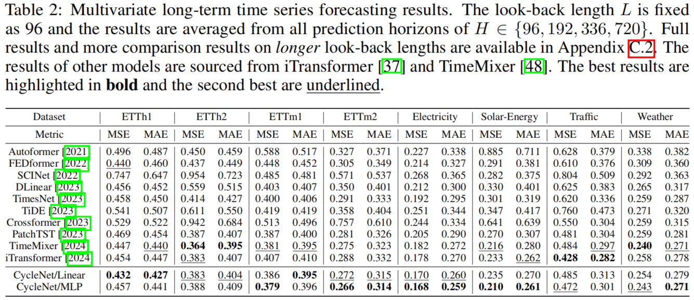
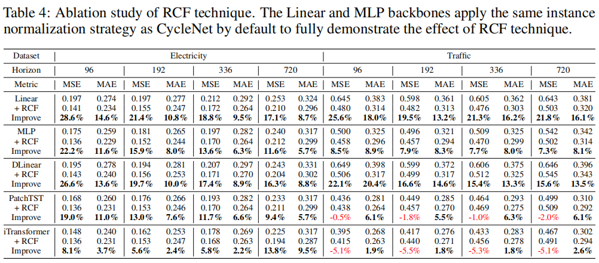

# CycleNet

Welcome to the official repository of the CycleNet paper: "[CycleNet: Enhancing Time Series Forecasting through Modeling Periodic Patterns](https://arxiv.org/pdf/2409.18479)". 

[[Poster|海报]](https://drive.google.com/file/d/1dBnmrjtTab4M5L9qfrdAp2Y_xr53hBZ1/view?usp=drive_link) -
[[Slides|幻灯片]](https://drive.google.com/file/d/1QcCCxRFtnFYPtaXmZiF4Zby5r-nl5tR5/view?usp=drive_link) - 
[[中文解读]](https://zhuanlan.zhihu.com/p/984766136)

## Updates
🚩 **News** (2025.05): Our latest work, [**TQNet**](https://github.com/ACAT-SCUT/TQNet), has been accepted to **ICML 2025**. TQNet is a powerful successor to CycleNet, addressing its limitation in *modeling inter-variable correlations* effectively.

🚩 **News** (2024.10): Thanks to the contribution of [wayhoww](https://github.com/wayhoww), CycleNet has been updated with a [new implementation](https://github.com/ACAT-SCUT/CycleNet/blob/f1deb5e1329970bf0c97b8fa593bb02c6d894587/models/CycleNet.py#L17) for generating cyclic components, achieving a 2x to 3x acceleration.

🚩 **News** (2024.09): CycleNet has been accepted as **NeurIPS 2024 _Spotlight_** (_average rating 7.25_, Top 1%).

**Please note that** [**SparseTSF**](https://github.com/lss-1138/SparseTSF), [**CycleNet**](https://github.com/ACAT-SCUT/CycleNet), and [**TQNet**](https://github.com/ACAT-SCUT/TQNet) represent our continued exploration of **leveraging periodicity** for long-term time series forecasting (LTSF). 
The differences and connections among them are as follows:

|                            Model                             |        Use of Periodicity         |            Technique             |                   Effect                   |      Efficiency      |                   Strengths                   |                      Limitation                       |
| :----------------------------------------------------------: | :-------------------------------: | :------------------------------: | :----------------------------------------: | :------------------: | :-------------------------------------------: | :---------------------------------------------------: |
| [**SparseTSF**](https://github.com/lss-1138/SparseTSF)  <br> **(ICML 2024 Oral**) |    Indirectly via downsampling    | Cross-Period Sparse Forecasting  |             Ultra-light design             |   < 1k parameters    |       Extremely lightweight, near SOTA        | Fails to cover multi-periods **(solved by CycleNet)** |
| [**CycleNet**](https://github.com/ACAT-SCUT/CycleNet) <br> **(NeurIPS 2024 Spotlight)** | Explicit via learnable parameters | Residual Cycle Forecasting (RCF) |         Better use of periodicity          | 100k ~ 1M parameters |      Strong performance on periodic data      | Fails in multivariate modeling **(solved by TQNet)**  |
|                  [**TQNet**](https://github.com/ACAT-SCUT/TQNet) <br> **(ICML 2025)**                   |    Serve as global correlations     |   Temporal Query in attention mechanism  | Robust inter-variable correlation modeling |    ~1M parameters    | Enhanced multivariate forecasting performance |     Hard to scale to ultra-long look-back inputs      |

## Introduction

CycleNet pioneers the **explicit modeling of periodicity** to enhance model performance in long-term time series forecasting (LTSF) tasks. Specifically, we introduce the Residual Cycle Forecasting (RCF) technique, which uses **learnable recurrent cycles** to capture inherent periodic patterns in sequences and then makes predictions on the *residual components* of the modeled cycles. 


The RCF technique comprises two steps: the first step involves modeling the periodic patterns of sequences through globally **learnable recurrent cycles** within independent channels, and the second step entails predicting the *residual components* of the modeled cycles.


The learnable recurrent cycles _**Q**_ are initialized to ***zeros*** and then undergo gradient backpropagation training along with the backbone module for prediction, yielding *learned representations* (different from the initial zeros) that uncover the cyclic patterns embedded within the sequence. Here, we have provided the code implementation [[visualization.ipynb](https://github.com/ACAT-SCUT/CycleNet/blob/main/visualization.ipynb)] to visualize the learned periodic patterns.


RCF can be regarded as a novel approach to achieve Seasonal-Trend Decomposition (STD). Compared to other existing methods, such as moving averages (used in DLinear, FEDformer, and Autoformer), it offers significant advantages.


As a result, CycleNet can achieve current state-of-the-art performance using only a simple Linear or dual-layer MLP as its backbone, and it also provides substantial computational efficiency.



In addition to simple models like Linear and MLP, RCF can also improve the performance of more advanced algorithms.



Finally, as an explicit periodic modeling technique, RCF requires that the period length of the data is identified beforehand. 
For RCF to be effective, the length ***W*** of the learnable recurrent cycles _**Q**_ must accurately match the intrinsic period length of the data.


To identify the data's inherent period length, a straightforward method is manual inference. For instance, in the Electricity dataset, we know there is a weekly periodic pattern and that the sampling granularity is hourly, so the period length can be deduced to be 168.

Moreover, a more scientific approach is to use the Autocorrelation Function (ACF), for which we provide an example ([ACF_ETTh1.ipynb](https://github.com/lss-1138/SparseTSF/blob/main/ACF_ETTh1.ipynb)) in the [SparseTSF](https://github.com/lss-1138/SparseTSF) repository. The hyperparameter ***W*** should be set to the lag corresponding to the observed maximum peak.


## Model Implementation

The key technique of CycleNet (or RCF) is to use learnable recurrent cycle to explicitly model the periodic patterns within the data, and then model the residual components of the modeled cycles using either a single-layer Linear or a dual-layer MLP. The core implementation code of CycleNet (or RCF) is available at:

```
models/CycleNet.py
```

To identify the relative position of each sample within the recurrent cycles, we need to generate cycle index (i.e., **_t_ mod _W_** mentioned in the paper) additionally for each data sample. The code for this part is available at:

```
data_provider/data_loader.py
```
The specific implementation code of cycle index includes:
```python
def __read_data__(self):
    ...
    self.cycle_index = (np.arange(len(data)) % self.cycle)[border1:border2]

def __getitem__(self, index):
    ...
    cycle_index = torch.tensor(self.cycle_index[s_end])
    return ..., cycle_index
```

This simple implementation requires ensuring that the sequences have **no missing values**. In practical usage, a more elegant approach can be employed to generate the cycle index, such as mapping real-time timestamp to indices, for example:
```python
def getCycleIndex(timestamp, frequency, cycle_len):
    return (timestamp / frequency) % cycle_len
```


## Getting Started

### Environment Requirements

To get started, ensure you have Conda installed on your system and follow these steps to set up the environment:

```
conda create -n CycleNet python=3.8
conda activate CycleNet
pip install -r requirements.txt
```

### Data Preparation

All the datasets needed for CycleNet can be obtained from the [[Google Drive]](https://drive.google.com/file/d/1bNbw1y8VYp-8pkRTqbjoW-TA-G8T0EQf/view) that introduced in previous works such as Autoformer and SCINet. 
Create a separate folder named ```./dataset``` and place all the CSV files in this directory. 
**Note**: Place the CSV files directly into this directory, such as "./dataset/ETTh1.csv"

### Training Example

You can easily reproduce the results from the paper by running the provided script command. For instance, to reproduce the main results, execute the following command:

```
sh run_main.sh
```

**For your convenience**, we have provided the execution results of "sh run_main.sh" in [**[result.txt](https://github.com/ACAT-SCUT/CycleNet/blob/main/result.txt)**], which contain the results of running CycleNet/Linear and CycleNet/MLP five times each with various input lengths {96, 336, 720} and random seeds {2024, 2025, 2026, 2027, 2028}.

You can also run the following command to reproduce the results of various STD techniques as well as the performance on the PEMS datasets (the PEMS datasets can be obtained from [SCINet](https://github.com/cure-lab/SCINet)):

```
sh run_std.sh
sh run_pems.sh
```

Furthermore, you can specify separate scripts to run independent tasks, such as obtaining results on etth1:

```
sh scripts/CycleNet/Linear-Input-96/etth1.sh
```


## Citation
If you find this repo useful, please cite our paper.
```
@inproceedings{cyclenet,
  title={CycleNet: Enhancing Time Series Forecasting through Modeling Periodic Patterns},
  author={Lin, Shengsheng and Lin, Weiwei and Hu, Xinyi and Wu, Wentai and Mo, Ruichao and Zhong, Haocheng},
  booktitle={Thirty-eighth Conference on Neural Information Processing Systems},
  year={2024}
}
```


## Contact
If you have any questions or suggestions, feel free to contact:
- Shengsheng Lin ([cslinshengsheng@mail.scut.edu.cn]())
- Weiwei Lin ([linww@scut.edu.cn]())
- Xinyi Hu (xyhu@cse.cuhk.edu.hk)

## Acknowledgement

We extend our heartfelt appreciation to the following GitHub repositories for providing valuable code bases and datasets:

https://github.com/lss-1138/SparseTSF

https://github.com/thuml/iTransformer

https://github.com/lss-1138/SegRNN

https://github.com/yuqinie98/patchtst

https://github.com/cure-lab/LTSF-Linear

https://github.com/zhouhaoyi/Informer2020

https://github.com/thuml/Autoformer

https://github.com/MAZiqing/FEDformer

https://github.com/alipay/Pyraformer

https://github.com/ts-kim/RevIN

https://github.com/timeseriesAI/tsai

